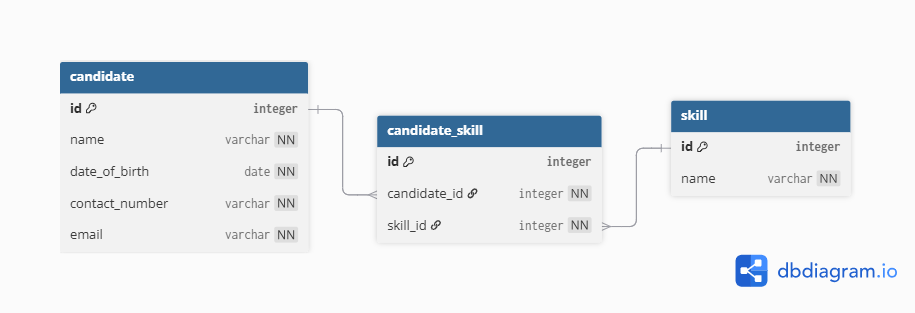

# Backend

## System Architecture

The application follows Clean Architecture principles with separated layers:

- **Presentation** – ASP.NET Core Web API controllers and application entry point
- **Application** – business logic and service implementations
- **Domain** – entities, interfaces, DTOs, and core abstractions
- **Infrastructure** – database access, Entity Framework Core, repositories, and seed data

---

## Database Design

Database contains the following entities:

- `Candidate`
- `Skill`
- `CandidateSkill`

Relationship between `Candidate` and `Skill` is many-to-many through `CandidateSkill`.


---

# Technologies Used

- C#
- .NET 8
- ASP.NET Core Web API
- Entity Framework Core
- MySQL
- Visual Studio
- Postman

---

# Features

- Add candidate
- Update candidate
- Delete candidate
- Add skill to candidate
- Remove skill from candidate
- Search candidates by:
  - name
  - skills
- Seed database with initial test data
- Validation for:
  - unique email
  - unique contact number
  - unique skill name

---

# Setup Instructions

## 1. Create database schema

Open MySQL Workbench and create schema:

```sql
CREATE SCHEMA hr_platform_db;
```

---

## 2. Configure connection string

In `appsettings.json` update your MySQL connection string:

```json
"ConnectionStrings": {
  "DefaultConnection": "server=localhost;database=hr_platform_db;user=root;password=your_password"
}
```

---

## 3. Apply migrations

Open **Package Manager Console**:

- Set `Infrastructure` as **Default Project**
- Set `Presentation` as **Startup Project**

Run:

```powershell
Update-Database
```

This will:
- create database tables
- apply constraints
- insert seed data

---

# Seed Data

Application comes with predefined:
- candidates
- skills
- candidate-skill relations

to simplify testing through Swagger or Postman.

---

# API Testing

API can be tested using:

- Swagger UI
- Postman
